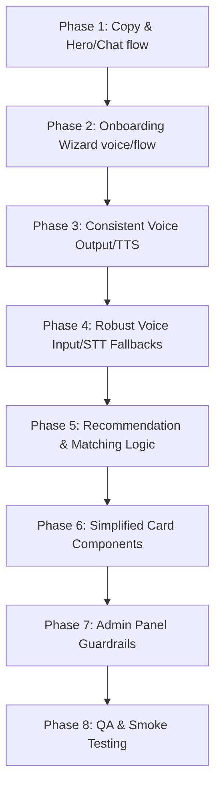

# Real-World User Experience Plan

This document outlines the product direction and design guidelines to make **Sudokkho** a Bangla-first, voice-friendly, and low-literacy-friendly job helper for Bangladeshi workers, specifically catering to less-educated urban workers.

## 1. Product Goal
> **Sudokkho should feel like a Bangla-speaking job helper, not a complex job portal.**
Instead of overwhelming the user with complicated filters, nested forms, and dense English terminology, the system acts as a friendly digital helper that listens, guides, and explains opportunities in clear Bangla.

---

## 2. Target User Problems
* **Low Reading Confidence:** Users struggle with dense paragraphs and fine print, particularly in English or technical Bangla jargon.
* **Low Digital Confidence:** Users may feel intimidated by typical job portals, search inputs, and complex navigational menus.
* **Confusion with Filters/Forms:** Sliders, multi-select filters, and complex fields cause navigation drop-offs.
* **Need for Safe Job Guidance:** Low-literacy workers are highly vulnerable to fraudulent recruiters and misinformation.
* **Need for Bangla Voice Support:** Users are more comfortable speaking their query and listening to explanations than typing and reading.
* **Risk of Unsafe Recruitment:** Workers need clear, trust-weighted indicators showing which official sources are verified and how to apply safely.

---

## 3. Primary User Journey
1. **Home:** Welcomed by a clean Bangla interface, a prominent voice input button, and simple rotating prompt guides.
2. **Voice/Chat Question:** User taps the mic and asks a natural query (e.g., *"মালয়েশিয়া যেতে কত লাগবে?"* or *"SSC পাসে কী চাকরি আছে?"*).
3. **Friendly Signup Prompt (if needed):** A frictionless registration page that preserves their original question in the redirect flow.
4. **Simple Onboarding:** A step-by-step wizard (one big question per screen, audio-enabled, giant tap targets) to learn user qualifications.
5. **Top 3 Matched Jobs:** Shows highly relevant matching opportunities based on computed profile similarity.
6. **Bangla Voice Explanation:** Clear read-aloud descriptions of the matches, focusing on salary, deadlines, and requirements.
7. **Clear Apply Steps:** Straightforward instructions on who to contact, what documents are needed, and how to stay safe.

---

## 4. Homepage Direction
* **Big Bangla Headline:** Clear, bold greeting focused on safety and simplicity.
* **One Main Chat/Voice Input:** A prominent, welcoming microphone button and text area positioned front and center.
* **One Clear CTA:** A primary button to submit queries.
* **Simple Rotating Helper Text:** Rotating suggestion prompts (e.g., *"আমি মালয়েশিয়া যেতে চাই"*, *"ড্রাইভিং চাকরি আছে?"*) showing users what they can say.
* **Avoid Opportunity Overload:** Do not show dense grids of cards above the fold. Keep the visual hierarchy clean.
* **Existing `HeroSlider`:** Streamline or simplify the existing slider layout so it doesn't distract from the voice search.

---

## 5. Signup/Onboarding Direction
* **Preserve Question Context:** Retain the user's initial question via request parameters (e.g., `next=/copilot?q=...`) through the register/login flow so they don't have to re-enter it.
* **Essential Questions Only:** Collect only what is critical to matching (preferred sectors, country, education level, current status).
* **One Question Per Screen:** Break up onboarding into single-purpose steps to reduce cognitive load.
* **Big Tap Buttons:** Sizable selection options, readable text, and generous spacing.
* **Bangla-First Labels:** High-contrast text using simple, everyday Bengali words.
* **Voice/Listen Support:** Add a play button to read out questions and options.
* **Text Fallback:** Always ensure options are readable and selectable via standard touch/keyboard actions.

---

## 6. Voice Direction
* **Browser SpeechRecognition:** Keep using client-side Web Speech API (`SpeechRecognition` / `webkitSpeechRecognition`) as the primary input mechanism for the first implementation, but the production direction should not depend only on browser voice support. Text fallback must always remain available.
* **Transcript Confirmation:** Let users see what the speech engine recognized before executing the search.
* **Clear Error States:** Provide friendly Bangla prompts for permission-denied, no-speech-detected, and unsupported browser states.
* **Consistent TTS (Text-to-Speech):** Establish uniform audio reading behavior across Copilot responses, onboarding screens, and opportunity detail sections.
* **Future STT Roadmap:** Maintain plan details for advanced server-side STT integration without implementing backend models in the immediate phase.

---

## 7. Recommendation Direction
Recommended opportunities must clearly answer the following questions for the user:
* **Why it fits:** *"Why does this match me?"* (e.g., matching their selected sector or destination country).
* **Documents needed:** What paperwork (passport, certificate, etc.) is required.
* **Bangladesh Applicability:** Whether applying directly from Bangladesh is allowed.
* **Basic requirements:** Simplified education and experience level.
* **Value & Time:** Clear salary figures and application deadline dates.
* **Trust & Safety Warnings:** Clear warnings about recruitment fees, visa validation, or verification status.
* **Next Action:** What exactly the user should do next (e.g., visit a government office, dial a phone number, or click an official link).

---

## 8. Opportunity Card Direction
The default card layout must be streamlined to highlight the essentials:
* **Core Info:** Job Title, Destination Country, Salary range, and Application Deadline.
* **BD Eligibility Badge:** A prominent "Apply from Bangladesh: Yes/No/Unknown" badge.
* **Qualifications:** Simplified education and experience requirements.
* **Trust Badge:** Colored trust tiers (e.g., Green for Official Government Source, Orange for Review Needed).
* **Listen Button:** A primary audio action button to hear details aloud.
* **Why it matches me:** Context-aware explanation (e.g. matching preferences).
* **Clear application steps:** Simple sequential steps explaining how to proceed.

---

## 9. Admin Direction
The admin section should focus on data curation, source aggregation, and system health checks:
* **Sources:** Adding and configuring RSS/HTML/API sources.
* **Review Queue:** Highlighting low-confidence crawls or listings flag-marked for verification.
* **System Health:** Monitoring active pipelines and database ingestion sizes.
* **Developer Guardrails:** Group dangerous configuration controls (like raw SQL operations, direct vector index updates, or system resets) into an advanced "Developer Tools" section to avoid accidental operational disruption.

---

## 10. Implementation Phases

### Phase 1: Product Copy & Homepage Hero/Chat Flow
* Update main layout titles, headings, and helper prompts.
* Polish Homepage Voice/Chat entry elements.
* Refine redirects to `/copilot`.

### Phase 2: Signup & Onboarding Wizard Continuation
* Update onboarding screens to support step-by-step layout.
* Implement TTS explanations for each step.
* Ensure user questions are successfully preserved after register/login actions.

### Phase 3: Voice Output Consistency
* Unify the TTS playback engine.
* Ensure clean audio generation fallbacks when native browser TTS fails.

### Phase 4: Voice Input Fallbacks
* Implement status notifications for mic access issues or background noise errors.
* Provide clean text fallbacks.

### Phase 5: Recommendation Scoring & Explanations
* Adjust recommendation score weighting to prioritize official government sources.
* Standardize matching descriptions in Bengali.

### Phase 6: Opportunity Card Simplification
* Redesign default cards for maximum readability.
* Integrate clean listen triggers.

### Phase 7: Admin Panel Guardrails
* Relocate advanced commands under developer settings cards.
* Clean up system logs.

### Phase 8: QA & Smoke Testing
* Validate login redirects, voice search redirection, onboarding states, and audio playbacks.
